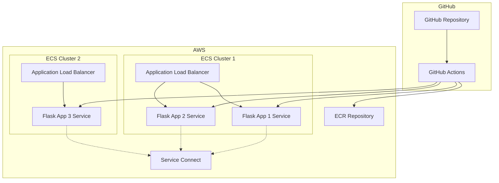

# Design Document

## Overview

This design outlines the deployment architecture for a multi-Flask application system on AWS ECS. The solution addresses current configuration issues and implements a robust, scalable deployment pipeline using GitHub Actions, ECR, and ECS with Service Connect for inter-service communication.

## Architecture

### High-Level Architecture



### Container Architecture

Each Flask application runs in its own ECS service with:
- Dedicated task definitions
- Shared ECR repository with different image tags
- Service Connect for internal communication
- Application Load Balancer for external access

## Components and Interfaces

### 1. Docker Configuration
- **Shared Dockerfile**: Single Dockerfile builds all three applications
- **Multi-stage builds**: Optimize image size and build time
- **Environment-specific configurations**: Each app uses different FLASK_APP environment variable

### 2. GitHub Actions Pipeline
- **Trigger**: Manual dispatch and main branch pushes
- **Build Process**: Single Docker build, multiple image tags
- **Deployment**: Parallel deployment to multiple ECS services
- **Secrets Management**: AWS credentials stored in GitHub secrets

### 3. AWS ECS Infrastructure
- **ECR Repository**: Single repository with app-specific tags
- **ECS Clusters**: Two clusters for service separation
- **Task Definitions**: Individual definitions for each Flask app
- **Services**: Auto-scaling services with health checks

### 4. Service Discovery
- **Service Connect**: Internal service-to-service communication
- **DNS Resolution**: Services discoverable by name within cluster
- **Load Balancing**: Application Load Balancers for external traffic

## Data Models

### Task Definition Structure
```json
{
  "family": "service-connect-demo-task-def-{app-number}",
  "networkMode": "awsvpc",
  "requiresCompatibilities": ["FARGATE"],
  "cpu": "256",
  "memory": "512",
  "containerDefinitions": [
    {
      "name": "flask-app-{number}",
      "image": "{ecr-uri}:flask-app-{number}-{tag}",
      "portMappings": [
        {
          "containerPort": 5000,
          "protocol": "tcp"
        }
      ],
      "environment": [
        {
          "name": "FLASK_APP",
          "value": "flask_app_{number}/app.py"
        }
      ]
    }
  ]
}
```

### Service Connect Configuration
```json
{
  "serviceConnectConfiguration": {
    "enabled": true,
    "namespace": "service-connect-demo",
    "services": [
      {
        "portName": "flask-port",
        "discoveryName": "flask-app-{number}",
        "clientAliases": [
          {
            "port": 5000,
            "dnsName": "flask-app-{number}"
          }
        ]
      }
    ]
  }
}
```## Erro
r Handling

### GitHub Actions Error Handling
- **Build Failures**: Fail fast with clear error messages
- **AWS Authentication**: Validate credentials before deployment
- **Image Push Failures**: Retry mechanism with exponential backoff
- **Deployment Failures**: Rollback to previous task definition version

### ECS Service Error Handling
- **Container Health Checks**: HTTP health check endpoints on each Flask app
- **Service Auto-Recovery**: ECS automatically replaces failed tasks
- **Resource Limits**: Proper CPU and memory limits to prevent resource exhaustion
- **Logging**: CloudWatch logs for debugging and monitoring

### Infrastructure Error Handling
- **Missing Resources**: Pre-deployment validation of ECR repositories and ECS clusters
- **Permission Issues**: Comprehensive IAM role validation
- **Network Connectivity**: VPC and security group configuration validation
- **Service Discovery**: Fallback mechanisms for service-to-service communication

## Testing Strategy

### Local Testing
- **Docker Compose**: Test multi-container setup locally
- **Environment Parity**: Match production environment variables
- **Service Communication**: Validate inter-service connectivity
- **Health Endpoints**: Test application health check endpoints

### CI/CD Testing
- **Build Validation**: Ensure Docker images build successfully
- **Security Scanning**: Container vulnerability scanning
- **Configuration Validation**: Validate task definitions and service configurations
- **Deployment Dry-Run**: Test deployment process without affecting production

### Production Monitoring
- **Health Checks**: Application-level health monitoring
- **Performance Metrics**: CPU, memory, and response time monitoring
- **Log Aggregation**: Centralized logging with CloudWatch
- **Alerting**: Automated alerts for service failures and performance issues

## Implementation Considerations

### Current Issues to Address
1. **GitHub Actions Syntax Error**: Fix `${{ secrets./quit }}` typo
2. **Missing Task Definitions**: Create proper JSON task definition files
3. **Image Tagging Strategy**: Implement consistent tagging for multiple apps
4. **Service Connect Setup**: Configure proper service discovery
5. **Load Balancer Configuration**: Set up ALB for external access

### Security Considerations
- **IAM Roles**: Least privilege access for ECS tasks and GitHub Actions
- **Network Security**: Proper VPC and security group configuration
- **Secrets Management**: Secure handling of AWS credentials and application secrets
- **Container Security**: Regular image updates and vulnerability scanning

### Scalability Considerations
- **Auto Scaling**: Configure ECS service auto-scaling based on CPU/memory
- **Load Balancing**: Distribute traffic across multiple container instances
- **Resource Optimization**: Right-size container resources for cost efficiency
- **Multi-AZ Deployment**: Deploy across multiple availability zones for high availability